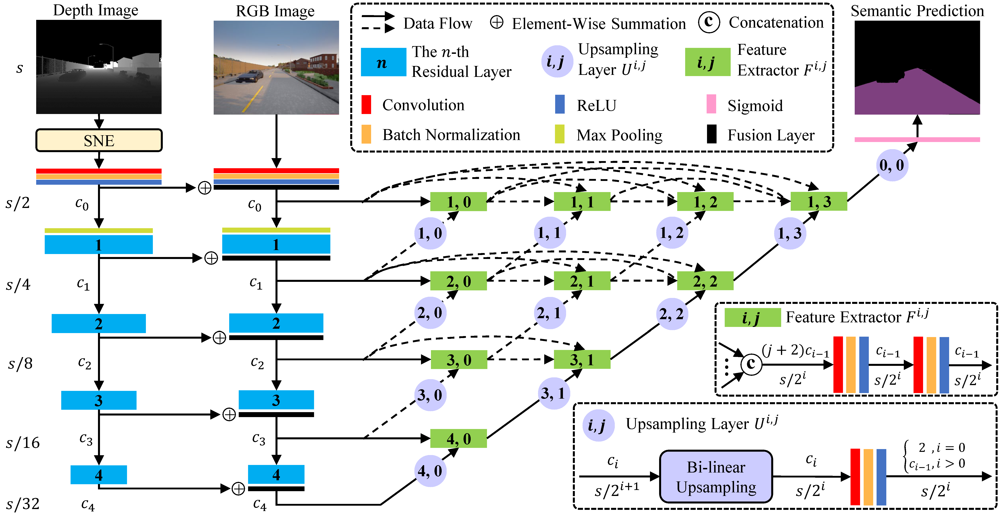

# SNE-RoadSeg


## Introduction
This is the official PyTorch implementation of [**SNE-RoadSeg: Incorporating Surface Normal Information into Semantic Segmentation for Accurate Freespace Detection**](http://www.ecva.net/papers/eccv_2020/papers_ECCV/papers/123750341.pdf), accepted by [ECCV 2020](https://eccv2020.eu/). This is our [project page](https://sites.google.com/view/sne-roadseg).

In this repo, we provide the training and testing setup for the [KITTI Road Dataset](http://www.cvlibs.net/datasets/kitti/eval_road.php). We test our code in Python 3.7, CUDA 10.0, cuDNN 7 and PyTorch 1.1. We provide `Dockerfile` to build the docker image we use.

<p align="center">

</p>

<p align="center">

</p>


## Setup
Please setup the KITTI Road Dataset and pretrained weights according to the following folder structure:
```
SNE-RoadSeg
 |-- checkpoints
 |  |-- kitti
 |  |  |-- kitti_net_RoadSeg.pth
 |-- data
 |-- datasets
 |  |-- kitti
 |  |  |-- training
 |  |  |  |-- calib
 |  |  |  |-- depth_u16
 |  |  |  |-- gt_image_2
 |  |  |  |-- image_2
 |  |  |-- validation
 |  |  |  |-- calib
 |  |  |  |-- depth_u16
 |  |  |  |-- gt_image_2
 |  |  |  |-- image_2
 |  |  |-- testing
 |  |  |  |-- calib
 |  |  |  |-- depth_u16
 |  |  |  |-- image_2
 |-- examples
 ...
```
`image_2`, `gt_image_2` and `calib` can be downloaded from the [KITTI Road Dataset](http://www.cvlibs.net/datasets/kitti/eval_road.php). We implement `depth_u16` based on the LiDAR data provided in the KITTI Road Dataset, and it can be downloaded from [here](https://drive.google.com/file/d/16ft3_V8bMM-av5khZpP6_-Vtz-kF6X7c/view?usp=sharing). Note that `depth_u16` has the `uint16` data format, and the real depth in meters can be obtained by ``double(depth_u16)/1000``. Moreover, the pretrained weights `kitti_net_RoadSeg.pth` for our SNE-RoadSeg-152 can be downloaded from [here](https://drive.google.com/file/d/17eqDPTs0Sv83Q7e-IWox_69bCbiXUzPU/view?usp=sharing).


## Usage

### Run an example ###
- Execute the following command.

example:
```
python run_example.py --sequence='00'
```

If you use this code for your research, please cite our paper.
```
@inproceedings{fan2020sne,
  author = {Fan, Rui and Wang, Hengli and Cai, Peide and Liu, Ming},
  title = {SNE-RoadSeg: Incorporating Surface Normal Information into Semantic Segmentation for Accurate Freespace Detection},
  booktitle = {Proceedings of the European Conference on Computer Vision (ECCV)},
  year = {2020},
  organization = {Springer},
}
```


## Acknowledgement
Our code is inspired by [pytorch-CycleGAN-and-pix2pix](https://github.com/junyanz/pytorch-CycleGAN-and-pix2pix), and we thank [Jun-Yan Zhu](https://github.com/junyanz) for their great work.
